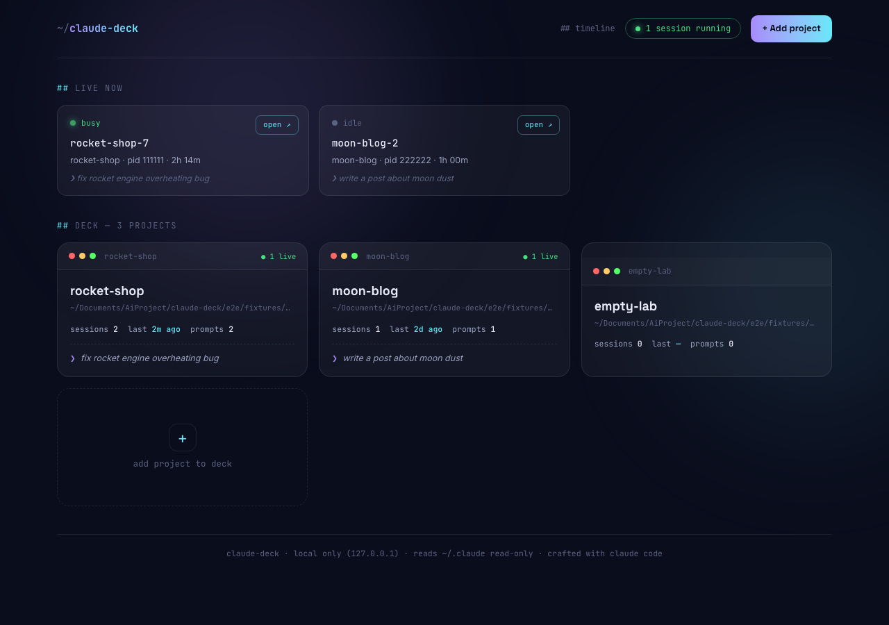
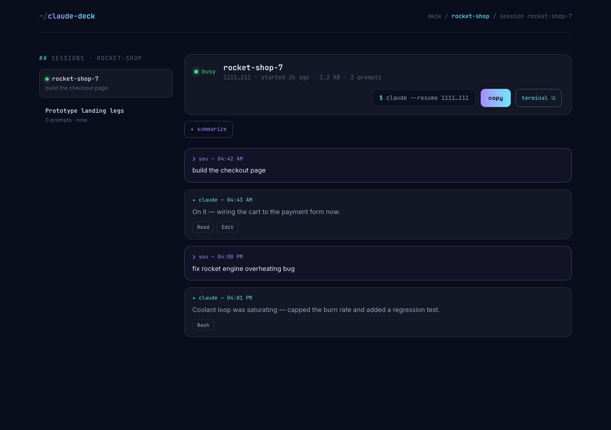
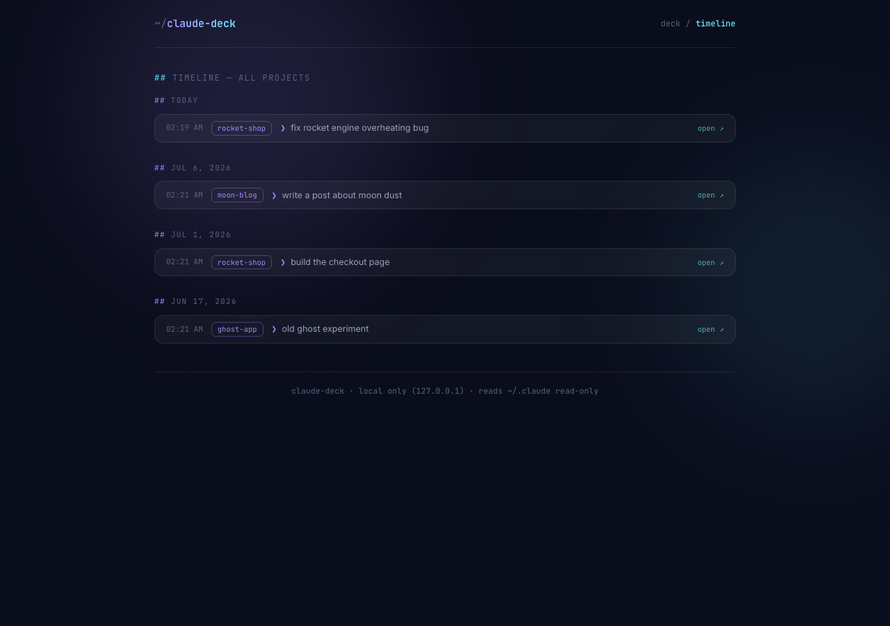
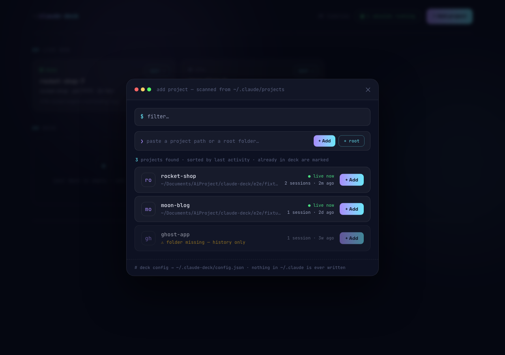

# ~/claude-deck

**A local dashboard for your Claude Code sessions — across every project.**

If you run Claude Code in several terminals at once, you know the feeling: which
terminal is doing what? What was that project working on last week? claude-deck gives
you one place to see it all — what's running right now, every project's session
history, full transcripts, and a one-click way to resume any session.



## Features

- **Live now** — every running Claude Code session on your machine: busy/idle status,
  project, pid, uptime, and the last prompt you typed. Dead processes are filtered out.
- **The deck** — your projects, added by you (the deck starts empty, nothing is
  auto-imported): session count, last activity, prompt count, latest prompt.
- **Session view** — browse any session's transcript (user prompts, assistant replies,
  tool-call chips), even multi-hundred-MB transcripts open instantly thanks to
  tail-windowed parsing.
- **Resume anywhere** — copy `cd <project> && claude --resume <id>` with one click, or
  (macOS) open a new Terminal window already resumed into the session.
- **AI summaries** — summarize a session on demand using your local `claude -p`
  (Haiku). Cached; re-runs only when the transcript grows.
- **Timeline** — one reverse-chronological feed of your prompts across *all* projects,
  grouped by day. "What was I doing yesterday, everywhere?"

| Session view | Timeline | Add project |
|---|---|---|
|  |  |  |

## Privacy & security

Your transcripts never leave your machine:

- The server binds **127.0.0.1 only** — nothing is exposed to the network.
- `~/.claude` is opened **strictly read-only**; claude-deck never writes there.
- **No telemetry, no external calls** — even fonts are bundled locally.
- claude-deck's own state lives in a single file: `~/.claude-deck/config.json`
  (plus `summaries.json` for cached AI summaries).
- AI summaries run through your local `claude` CLI under your own account, and only
  a compact text excerpt of the transcript is passed to it.

## Requirements

- Node.js 20+
- [Claude Code](https://claude.com/claude-code) installed (that's where the data
  comes from) — the `claude` CLI is also used for optional AI summaries
- macOS for the optional "open in Terminal" button (everything else is cross-platform)

## Install & run

```sh
git clone https://github.com/LekTerMiNaL/claude-deck.git
cd claude-deck
npm install
npm run build
npm start        # → http://127.0.0.1:5757
```

For development (hot reload):

```sh
npm run dev      # Vite dev server on :5173, API on :5757
```

Set `CLAUDE_DECK_PORT` to change the port.

## Usage

1. Open `http://127.0.0.1:5757`. The **LIVE NOW** row already shows any running
   sessions; the deck below starts empty.
2. Click **+ Add project** and add projects any of three ways:
   - pick from the scanned list (everything that has Claude Code history),
   - paste a project path,
   - paste a **root folder** (e.g. `~/code`) and register it with **+ root** — all its
     subfolders become addable, including ones with no Claude history yet.
3. Click a project card to browse its sessions and transcripts.
4. Use **copy** / **terminal ⧉** in a session header to resume it, **✦ summarize**
   for an AI recap, and **## timeline** in the header for the cross-project feed.

## Development

```sh
npm run typecheck   # tsc --noEmit
npm test            # Vitest unit tests
npm run test:e2e    # Playwright e2e (against a synthesized fixture ~/.claude)
npm run qa:shots    # screenshot pass over the fixture world → shots/
```

All tests run against **synthesized fixtures** — no real transcript data is used or
committed. See `docs/spec/` for the feature specs and `docs/mockups/` for the original
design mockups.

## License

[MIT](LICENSE)
